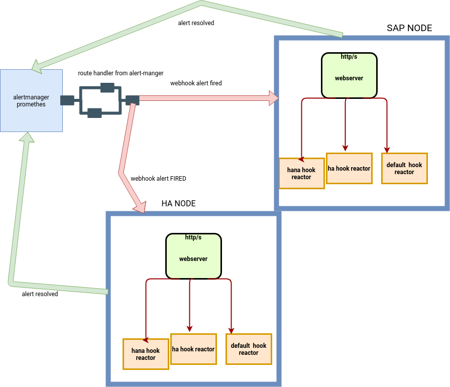

# Design documentation

The handler is installed on each node. The alertmanager will then route redirect to the right handler the alerts, filtered by labels etc.

The role of the handler is to react with an action , automatically to the hook sent by the prometheus alertmanager.
